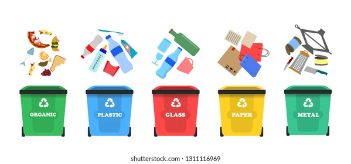

# Garbage Classification dataset
### Deep learning

### Table of Contents

  
Table of Contents

  - [About The Project](#about-the-project)
  - [Built With](#built-with)
  - [Getting Started](#getting-started)
    - [Prerequisites](#prerequisites)
  - [Usage](#usage)
  - [Process](#process)
  - [Demo Video](#demo-video)

## About The Project
In this project, we explore deep learning techniques to develop an effective image classification model for garbage sorting. We focus on convolutional neural networks (CNNs) to automatically categorize waste into different types, such as plastic, metal, paper, and organic material. Through data preprocessing, model architecture optimization, and hyperparameter tuning, we aim to enhance the model’s accuracy and generalization. The performance of the model is evaluated using metrics such as accuracy and loss, providing insights into its effectiveness for real-world waste classification applications.
### Error Heatmap

Diffrent classes: plastic, trash, carboard, paper, glass, metal

The following heatmap shows the confusion matrix to analyze classification errors:

Feature maps of the first conv layer:

Results of loaded images of different garbage categories from online sources:

### Built With
* Programming Languages: Python.
* Libraries: PIL, collections, glob, io, kagglehub, matplotlib, numpy, os, random, requests, seaborn, scikit-learn, tensorflow, keras.
* Techniques: Supervised Learning, Cross-validation, Deep Learning, Data Augmentation.

## Getting Started
### Prerequisites
Make sure you have the following installed:

* Python 3.x.
* Pip – Python’s package manager for installing dependencies.
* Google Colab – Access it via Google Colab, no installation required.
* Required Libraries – Install necessary packages for deep learning and image processing.
* Enable GPU for Faster Training.

## Usage
* Upload the Notebook to Google Colab – Open Google Colab and upload Final_Project_v2_Deep_Learning3.ipynb.
* Run the Notebook – Execute the cells sequentially to preprocess data, train the model, and evaluate results.
* Modify Parameters – Adjust hyperparameters, model architecture, or dataset configurations to experiment with different settings.
* Analyze Results – Review performance metrics, confusion matrices, and visualizations to refine your model.

## Process
* Loading and Preparing the Dataset – Importing the dataset, handling file structures, and performing necessary preprocessing.
* Exploratory Data Analysis (EDA) – Identifying missing values, handling duplicates, and visualizing data distributions.
* Baseline Model Testing – Evaluating multiple learning algorithms to establish a baseline F1 score.
* Model Selection with Cross-Validation – Conducting 5-fold cross-validation to identify the best-performing algorithm.
* Training the Best Model – Fine-tuning hyperparameters and training the dataset using the selected model.
* Performance Evaluation – Creating a confusion matrix, visualizing model accuracy, and analyzing classification performance.
* Optimizations & Improvements – Applying techniques such as data augmentation, hyperparameter tuning, and model ensembling (if applicable).

## Demo Video
[Click here to watch the demo video](https://www.youtube.com/watch?v=GpCbY-wfVFE&t=1s)
